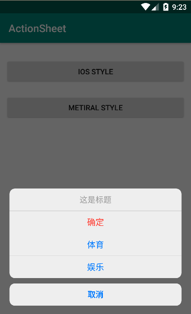
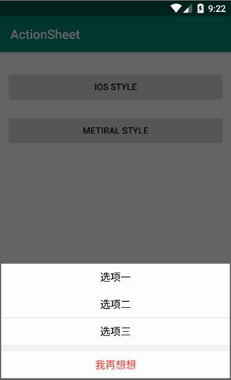

# ActionSheet [](https://jitpack.io/#GitSmark/ActionSheet)
An Android IOS style ActionSheet.

 
 
 

Usage
-----
  1. In project build.gradle
  ```
  repositories {
    maven {
      url "https://jitpack.io"
    }
  }
  ```
  2. In app build.gradle
  ```
  implementation 'com.github.GitSmark:ActionSheet:1.0.2'
  ```
* Set the ActionSheet style
 ```java
  actionSheet = new ActionSheet.DialogBuilder(this)
      //.setTheme(ActionSheet.ActionSheetMetiralStyle)
      //.setTitleTextColor(Color.parseColor("#040404"))
      //.setSheetTextColor(Color.parseColor("#007AFF"))
      //.setCancelTextColor(Color.parseColor("#FF3B30"))
      //.setTitle("这是标题")
      //.setCancel("取消")
      .addSheet("确定", Color.parseColor("#FF3B30"), this)
      .addSheet("体育", this)
      .addSheet("娱乐", this)
      .addCancelListener(new View.OnClickListener() {
          @Override
          public void onClick(View v) {
              Toast.makeText(MainActivity.this, "取消", Toast.LENGTH_SHORT).show();
              actionSheet.hide();
          }
      })
      .create();

  //actionSheet.setCanceledOnTouchOutside(false);
  //actionSheet.setCancelable(false);
  actionSheet.show();
 ```
* Closed the ActionSheet
 ```java
  actionSheet.dismiss();
  //actionSheet.hide();
  ```
  
  See csdn blog for details [Sure_Min - Ios ActionSheet](https://blog.csdn.net/Sure_Min/article/details/79054352)

Sample
------


Contact
--------
  Have problem? Just [tweet me](https://twitter.com/huangxy) or [send me an email](mailto:huangxy8023@foxmail.com).

License
----------

    Copyright 2016 huangxy@GitSmark

    Licensed under the Apache License, Version 2.0 (the "License");
    you may not use this file except in compliance with the License.
    You may obtain a copy of the License at

       http://www.apache.org/licenses/LICENSE-2.0

    Unless required by applicable law or agreed to in writing, software
    distributed under the License is distributed on an "AS IS" BASIS,
    WITHOUT WARRANTIES OR CONDITIONS OF ANY KIND, either express or implied.
    See the License for the specific language governing permissions and
    limitations under the License.


